<div align="center">

# Quiz

Small games that teach one thing at a time: count the beats, pick the sound, match the pairs, order the line, each round short enough to finish

[![Live][badge-site]][url-site]
[![HTML5][badge-html]][url-html]
[![CSS3][badge-css]][url-css]
[![JavaScript][badge-js]][url-js]
[![Claude Code][badge-claude]][url-claude]
[![License][badge-license]](LICENSE)

[badge-site]:    https://img.shields.io/badge/live_site-0063e5?style=for-the-badge&logo=googlechrome&logoColor=white
[badge-html]:    https://img.shields.io/badge/HTML5-E34F26?style=for-the-badge&logo=html5&logoColor=white
[badge-css]:     https://img.shields.io/badge/CSS3-1572B6?style=for-the-badge&logo=css3&logoColor=white
[badge-js]:      https://img.shields.io/badge/JavaScript-F7DF1E?style=for-the-badge&logo=javascript&logoColor=black
[badge-claude]:  https://img.shields.io/badge/Claude_Code-CC785C?style=for-the-badge&logo=anthropic&logoColor=white
[badge-license]: https://img.shields.io/badge/license-MIT-404040?style=for-the-badge

[url-site]:   https://quiz.neorgon.com/
[url-html]:   #
[url-css]:    #
[url-js]:     #
[url-claude]: https://claude.ai/code

</div>

---

## Overview

Quiz runs four small Japanese drills in the browser: count the beats of a
loanword, pick the sound of a kana, match two columns, put a song line back in
order. A round is 5, 10 or 20 items, and every wrong answer gets a picture
before a sentence: the word cut into equal-width beat tiles, the kana's own row
lit on the chart, the song line with the misplaced piece marked. Nothing is
uploaded, no account exists, and the score stays on the device.

Any other site can embed a game in an iframe and read the answers back over a
versioned `postMessage` vocabulary. That is how Runcible attaches a game to a
chapter and counts each answer as evidence toward a skill. The set format and
the embed contract are published at [`llms.txt`](llms.txt), so a language model
can write a set that loads first time.

**Live:** quiz.neorgon.com

---

## The four games

- **Beats** -- how many beats does this word have? The katakana is shown large and
  the source word under it; romaji is withheld until after the answer, because
  `baggu` spells out the count. The explanation is the word cut into beats and
  lit in sequence like a metronome, a small っ or ー getting the same tile width
  as everything else, which is the whole lesson
- **Sound** -- which sound is this kana, or which kana makes this sound? The
  direction is chosen per item by seed. The explanation is one row of the kana
  chart with the target cell lit, so a miss is placed on the chart rather than
  just corrected
- **Pairs** -- a board of four pairs, left column in set order, right column
  shuffled. Nothing but the two faces is on the board: no romaji, no gloss, no
  reading, and the format refuses a pair where either side contains the other
- **Order** -- put a song line back in order from a bank of chips. A miss shows
  the correct line with the first misplaced token outlined and the learner's
  token struck through underneath, then the gloss

---

## Features

- **Every wrong answer is explained, and the explanation is a picture first** -- the
  beat tiles, the lit kana row, the marked line. A wrong answer with no `why` is
  a defect the engine logs, not an accepted state
- **No digit ever printed inside an option** -- an ordered keycap is a separate box
  beside the button, `aria-hidden`, with `data-key` and `aria-keyshortcuts` on
  the button itself. A numbered `1. 2. 3.` list of options is the exact
  complaint this site was built to answer. Beats is the one exception, where the
  numeral tiles are their own keys
- **One JSON document per set, validated by one implementation** -- `neo-quiz-set/1`,
  with a set serving exactly one game. `js/validate-set.js` is the rule and both
  the browser and the CLI import it, so a built-in file and a fetched `?set=` URL
  are judged the same way before either reaches the round or the scores
- **Embed mode with a versioned contract** -- `?embed=1` strips the chrome to a slim
  bar with an "Open in Quiz" link. Five engine-to-host messages, three
  host-to-engine, every one carrying `v: 1`, posted to the referrer's origin and
  never to `*`. Silence after `quiz:ready` is documented as a fault, because a
  frame that stops reporting still looks like a working game
- **An origin allowlist with teeth** -- nothing a host can send writes storage, so
  the allowlist decides one thing: whether an embedded frame persists at all. It
  is a label-boundary check, not a suffix check, and `tools/test-origin.mjs`
  covers the suffix bug (`evil-neorgon.com`), the trailing-dot host, `"null"`
  and the rest
- **Scores namespaced by where the set came from** -- a set fetched from an origin
  off `neorgon.com` is keyed `ext:<12 hex of sha256 of the URL>:<id>`, so a
  third-party document claiming a built-in id cannot merge into real progress
- **Bilingual throughout** -- every learner-facing string is an `{ en, es }` pair,
  and when a Spanish reader is shown something that fell back to English the
  screen says so once, in one line, rather than pretending
- **Keyboard first** -- `1` to `9` answer, Space or Enter continues, Backspace undoes
  a piece in order, Esc asks before leaving, `R` restarts, `?` opens the
  shortcut sheet, `H` hides the chrome, `G` switches site, all through the
  NeoKeys kit with its typing guard and WCAG 2.1.4 remap panel
- **Timed, never raced** -- the milliseconds per answer are recorded and reported on
  the results screen. There is no countdown, no timer bar and no percent grade

---

## The set format, in one paragraph

A set is one JSON object: `format: "neo-quiz-set/1"`, a stable `id` (scores are
keyed by it), a `version` date bumped on any content change, the `game` it
serves, a bilingual `name`, an optional dotted `skill`, a `licence` block, and
`items` shaped for that game. No field may contain markup, and every
learner-facing string is a bilingual value. The per-game item shapes, the URL
parameters, the eight embed messages, the game module interface and the two
storage keys are all in [`llms.txt`](llms.txt), which is the contract and wins
over every other document here. [`docs/DESIGN.md`](docs/DESIGN.md) renders that
contract as visual and interaction design.

## Embedding

```html
<iframe src="https://quiz.neorgon.com/?embed=1&game=beats&limit=10&set=jp-loanwords-beats"
  width="100%" height="560" loading="lazy" style="border:0"
  title="Loanword beats · Quiz"></iframe>
```

```js
const QUIZ = 'https://quiz.neorgon.com';
window.addEventListener('message', (e) => {
  if (e.origin !== QUIZ || e.source !== frame.contentWindow) return;
  const m = e.data;
  if (!m || m.v !== 1) return;
  if (m.type === 'quiz:ready')  { if (m.store === 'ephemeral') warnNotSaved(); }
  if (m.type === 'quiz:answer') { record(m.itemId, m.skill, m.correct, m.ms); }
});
frame.addEventListener('load', () => {
  frame.contentWindow.postMessage({ v: 1, type: 'quiz:hello' }, QUIZ);
});
```

The engine sends `quiz:ready`, `quiz:answer`, `quiz:session-end`, `quiz:error`
and `quiz:resize`; it accepts `quiz:hello`, `quiz:start` and `quiz:theme`. Send
`quiz:hello` on the iframe's load event: the engine can be ready before your
listener exists. `quiz:session-end` carries `complete`, which is false when the
learner left the round early, so a host marking an exercise finished should
check it. Full vocabulary in [`llms.txt`](llms.txt).

Where a round is written is reported honestly rather than promised.
`quiz:ready` carries `store: "engine"` when the frame persists to
`quiz:scores:v1`, and `store: "ephemeral"` when it does not. An embed on
`neorgon.com` or one of its subdomains gets `"engine"` (a same-site guarantee
only: browsers partition third-party storage by top-level site, and Safari may
partition even this case). Any other host, or a frame with no referrer, gets
`"ephemeral"`, one visible line saying scores are not saved here, and the "Open
in Quiz" link as the path that always persists.

---

## Data and licences

The code is MIT. **The sets are not.** They are derived data and inherit their
source licences.

| Sets | Derived from | Licence | On-screen acknowledgement |
|---|---|---|---|
| `jp-loanwords-beats`, `jp-first-words-pairs` | JMdict (EDRDG) | CC BY-SA 4.0 | required |
| `jp-hiragana-sound`, `jp-katakana-sound`, `jp-hiragana-pairs`, `jp-katakana-pairs` | the corpus kana tables | public domain | none |
| 19 `jp-song-<id>-order` sets | school songs published 1881 to 1921, and Edo-period warabe uta | public domain | none |

EDRDG's licence asks for its acknowledgement on each screen display, so the
engine renders a set's `attribution` under the round on every screen that shows
that set, in embed mode too, whenever the set declares `"screen": "required"`.
It is a visible line with the rest of the attribution behind a disclosure, not a
link to a modal. That sentence is quoted in EDRDG's own wording: do not improve
it. While any beats item uses an explanation from the katakana adaptation rules,
the generator appends that credit (English Wikipedia CC BY-SA 4.0, the Agency
for Cultural Affairs Cabinet Notices, and Tofugu) to the same line.

Each song set is public domain and its screen obligation is `none`, but it still
carries the lyricist, the composer, the first publication, the authors' death
years and both public-domain verdicts (Japan and the United States, the second
because the URAA restored anything still protected at home in 1996) in a
`_licence` block, because those years are the whole basis of the verdict.
Nothing here uses Tatoeba: the four games take no sentence, unlike Rappel's
`jp-sentences-basic` deck.

If you redistribute a built-in set, keep its `licence` and `_licence` blocks
intact and render the acknowledgement wherever you show the items.

**The sets are generated, not written.** All 25 of them (482 items) are emitted
by `projects/runcible-site/tools/build-sets.mjs`, which writes each one twice,
here and into `runcible-site/books/japanese/sets/`, and refuses to finish if the
two copies differ. Do not hand edit one; the next run overwrites it.
[`data/README.md`](data/README.md) has the full procedure, the per-set corpus
sources, and what could not be derived.

---

## Running locally

ES modules require an HTTP server (not `file://`):

```bash
make serve       # http://localhost:8880
make validate    # every set, then the index against its files. Plain node, no install
```

`make validate` exits 0, or exits 1 naming the file, the item and the field. It
checks every set under `data/sets` against `neo-quiz-set/1`, adds the house
rules a third-party document is not held to (no em or en dash, no unknown
field), and then checks the index against the files it names. Nothing runs it
for you, it is not in root `make smoke`, and it is the definition of done for
any change under `data/` or `js/`. `node tools/test-origin.mjs` is the allowlist
suite; run it after any change to `js/origin.js`.

There is no install step, no bundler and no backend.

---

## Architecture



Zero build: plain ES modules over the CDN's `base.css` tokens. `js/app.js`
wires and decides nothing; `js/router.js` reads the URL, decides where scores
live, resolves the set, loads its game, runs the round and shows the results.
The four games are dynamic imports and speak only to the small `api` the round
hands them, so a game never touches storage, the URL or the bridge.

```
quiz-site/
├── index.html              # App shell: header, one column surface, live regions, attribution slot
├── llms.txt                # The set format and the embed contract, written for LLMs and hosts
├── css/
│   └── style.css           # Site styles over CDN base.css. Identity is --accent: #fb923c
├── js/
│   ├── app.js              # Entry point, 18 lines. Wires and nothing else
│   ├── router.js           # Boot and the screen switch: URL, store decision, set, game, round, results
│   ├── round.js            # The round runner: shuffle by seed, mount one item, score, streak, feedback
│   ├── state.js            # Shared state; quiz:prefs:v1 and quiz:scores:v1 via the Persist kit
│   ├── sets.js             # One path in: built-in id or ?set= URL, same cap, same validator, same namespacing
│   ├── validate-set.js     # neo-quiz-set/1. Pure, never throws. Browser and CLI share it
│   ├── origin.js           # Allowlist, ?set= rule, ext: namespacing. Pure functions
│   ├── embed.js            # ?embed= config, chrome strip, postMessage in both directions
│   ├── render.js           # Library, skeleton, error, results, the licence acknowledgement
│   ├── ui.js               # Keycap, progress track, streak badge, feedback panel, live regions
│   ├── keys.js             # Shortcuts registered with NeoKeys. Enter on a focused control is that control's
│   ├── strings.js          # Every learner-facing string as an { en, es } pair
│   ├── utils.js            # h() DOM builder, escaping, seeded rng, median
│   ├── games/
│   │   ├── index.js        # The four ids, each a dynamic import. A missing module is a named error
│   │   ├── shared.js       # Options, verdict marks, seeded shuffle, clock, announcements
│   │   ├── beats.js        # Numeral tiles, and the word cut into beats as the why
│   │   ├── sound.js        # Both directions by seed; the kana row strip as the why
│   │   ├── pairs.js        # A four pair board; the missed pairs as the why
│   │   └── order.js        # Slots and a chip bank; the marked line as the why
│   ├── neokeys/            # NeoKeys kit, vendored
│   └── neorgon-*.js        # Header, footer, beacon and persist kits, vendored
├── data/
│   ├── README.md           # Where each set comes from, what could not be derived, how to roll back
│   └── sets/               # index.json (neo-quiz-set-index/1) plus 25 generated neo-quiz-set/1 files
├── tools/
│   ├── validate-set.mjs    # CLI front end plus the house checks. make validate
│   └── test-origin.mjs     # The allowlist, negative cases included
├── docs/
│   ├── DESIGN.md           # Visual and interaction design, rendering the llms.txt contract
│   └── architecture.mmd    # Source for architecture.svg
├── 404.html
├── CNAME
├── Makefile
└── README.md
```

---

<div align="center">
<sub>Part of <a href="https://neorgon.com/">Neorgon</a></sub>
</div>
